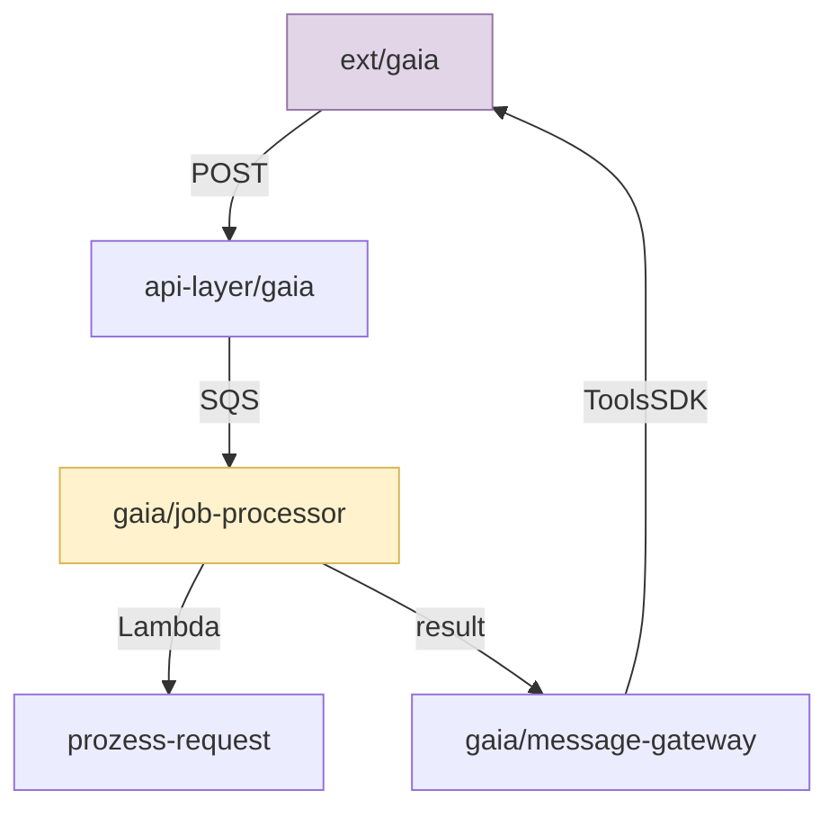

# Pathfinder v2 — Proposal

> Architecture knowledge layer for LLM agents: auto-discover, selectively load, visually validate, and enforce component boundaries.

**Authors:** CYD Team  
**Date:** 2026-04-09  
**Status:** Draft  
**Context:** Learnings from pathfinder v1 brownfield discovery on ChatYourData (74 components, 30 flows, ~60 CLI calls, multiple CLI bugs)

---

## 1. Problem Statement

LLM agents working on large codebases need architectural knowledge to make correct decisions. Today there are two extremes:

| Approach | Pros | Cons |
|----------|------|------|
| **CLAUDE.md** (prose) | Zero-cost loading, rich operational context, human-maintained | All-or-nothing (full file every session), scales poorly past ~4K tokens, goes stale silently, not queryable |
| **Pathfinder v1** (structural graph) | Queryable, exportable, validatable | High setup cost (60+ CLI calls), each query is a tool call, no operational knowledge, CLI ergonomics issues |

Neither alone is sufficient. Both fail at the core need: **load the right architectural knowledge at the right time with minimal token overhead.**

Additionally, neither provides a fast way for the **human** to validate the agent's understanding — the human must read prose or raw component lists, not see a visual representation.

---

## 2. Design Principles

1. **Token efficiency above all.** Every token in context that isn't relevant to the current task is waste.
2. **Auto-derive structure, manually confirm boundaries.** The graph should bootstrap from code. Humans correct it, not create it.
3. **Visual validation loop.** Humans validate architecture understanding through diagrams, not by reading YAML.
4. **Guardrails over documentation.** Preventing violations is more valuable than describing the architecture.
5. **Integrated, not bolted on.** Architecture knowledge should be part of the agent's workflow, not a separate CLI tool.

---

## 3. Four Knowledge Layers

### Layer 1: Conventions (CLAUDE.md)
**What:** Coding rules, security mandates, build commands, naming patterns.  
**Maintained by:** Humans.  
**Loaded:** Auto-injected every session (keep lean — conventions only, no architecture prose).  
**Changes rarely.** ~500-1000 tokens max.

### Layer 2: Structure (Pathfinder graph)
**What:** Components, ownership, flows, code mappings, external systems.  
**Maintained by:** Auto-derived from code + human-confirmed boundaries.  
**Loaded:** On demand, sliced by task.  
**Changes when code changes.** Validated continuously.

### Layer 3: Task Context (compiled on demand)
**What:** The intersection of Layer 1 + Layer 2 relevant to the current task.  
**Maintained by:** Generated, not stored.  
**Loaded:** Once at task start.  
**Disposable.** ~200-500 tokens.

### Layer 4: Embedded Viewing (visual validation)
**What:** Token-efficient diagrams (SVG/Mermaid) of flows, boundaries, and component relationships.  
**Purpose:** Human validates agent's understanding, catches misclassifications, corrects boundaries.  
**Generated on demand.** Supports iterative refinement ("OpenAPI should be a datasource, not a service").

---

## 4. Proposed API

Replace 25+ CLI commands with a semantic API designed for LLM consumption.

### 4.1 Context Loading

```
pathfinder context <task-description>
```

Returns a focused document combining:
- Relevant components and their relationships
- Data flows in the affected area
- Code file ownership
- Applicable conventions from CLAUDE.md
- Known constraints and boundaries

**Example:**
```bash
$ pathfinder context "fix SQS parsing in GAIA job processor"

# Context: GAIA Job Processing
Components: gaia/job-processor, gaia/message-gateway, prozess-request/strategy
Flows:
  ext/gaia --> api-layer/gaia [POST /gaia/{id}]
  api-layer/gaia --> gaia/job-processor [SQS: gaia-job-queue]
  gaia/job-processor --> prozess-request/strategy [Lambda invoke]
  gaia/job-processor --> gaia/message-gateway [SQS result]
  gaia/message-gateway --> ext/gaia [ToolsSDK.send_message]
Files:
  api/external/gaia_job_processor/code/lambda_function.py
  api/external/gaia_message_gateway/code/lambda_function.py
Conventions:
  - Use log_event_safely() for all event logging
  - Lambda handler signature: lambda_handler(event, context)
```

Single call. ~300 tokens. Everything the agent needs.

**Implementation complexity: MEDIUM.** Requires:
- Keyword/file-path matching to identify relevant components
- Graph traversal (1-2 hops from matched components)
- Convention extraction from CLAUDE.md by component tags
- Template-based output formatting

**Options:**
- (a) Simple keyword-to-component mapping + BFS graph traversal — works today
- (b) LLM-assisted task parsing to identify components — more accurate, higher cost
- (c) File-path based: if the user is editing `gaia_job_processor/`, resolve component from code mapping — most reliable

### 4.2 Impact Analysis

```
pathfinder impact <file-or-component>
```

Returns what depends on this component, what it depends on, and what flows through it.

**Example:**
```bash
$ pathfinder impact db_accessor.py

Component: main-module/orchestrator
Upstream: api-layer/client (Lambda invoke)
Downstream: prozess-request/strategy (Lambda invoke)
Also touches: common/llm (import), common/security (import)
Flows through: 2 (main request flow, GAIA async flow)
Risk: HIGH — routing hub, affects all database backends
```

**Implementation complexity: LOW.** Pure graph traversal on existing pathfinder data. The `dependents`/`deps`/`trace` commands already exist — this just combines them into one output.

### 4.3 Boundary Check

```
pathfinder check [--files <changed-files>]
```

Validates that code changes respect component boundaries. Reports:
- New imports that cross undeclared boundaries
- Files that don't belong to any component
- Flows that exist in code but not in the graph (drift)

**Example:**
```bash
$ pathfinder check --files api/code/api_cyd_client_v1/lambda_function.py

OK: api-layer/client
  Imports common.security -> common/security (declared flow)
  Imports common.llmapi_2_0_factory -> common/llm (declared flow)
WARN: Imports main_module.chat_history -> main-module/orchestrator (NO declared flow)
```

**Implementation complexity: HIGH.** Requires:
- AST parsing (Python imports, TypeScript imports) to extract actual dependencies
- Comparison against declared flows in the graph
- Needs to handle dynamic imports, conditional imports, test-only imports

**Options:**
- (a) Simple regex-based import scanning — fast, 80% accurate, misses dynamic imports
- (b) AST-based with tree-sitter — accurate, language-specific parsers needed
- (c) LSP integration — most accurate, reuses existing language servers, but complex setup
- (d) **Pragmatic middle ground:** Run on `git diff` output only, regex-based, flag unknowns for human review

### 4.4 Visual Generation

```
pathfinder view [<component-or-flow>] [--format svg|mermaid]
```

Generates a token-efficient diagram for human validation.

**Modes:**
- `pathfinder view` — full system context diagram (like the SVG we built)
- `pathfinder view gaia` — focused component diagram with its flows
- `pathfinder view --trace frontend prozess-request` — end-to-end flow diagram
- `pathfinder view --externals` — external systems and their touchpoints

**Example output (Mermaid, for inline rendering):**


**Why this matters:** The human sees a diagram, spots that a boundary is wrong ("OpenAPI isn't a service, it's a datasource"), and corrects it immediately. Much faster than reading component lists.

**Implementation complexity: LOW-MEDIUM.**
- Mermaid generation from graph data is straightforward (template + traversal)
- SVG generation is harder (layout algorithm needed, or use the style guide templates)
- Could delegate SVG to the LLM agent (it already knows how, as this session proved)

**Options:**
- (a) Mermaid-only — trivial to implement, renders in any markdown viewer
- (b) Mermaid + DOT export (existing) — let external tools (Graphviz) handle layout
- (c) SVG templates per diagram type — high quality but labor-intensive to maintain
- (d) **Recommended:** Mermaid for quick validation, delegate full SVG to the agent when needed

---

## 5. Auto-Discovery (Bootstrapping)

### The v1 Problem
Discovery required 60+ manual CLI calls: `add`, `set --spec`, `map --glob`, `flow-add` for every component. This is unsustainable.

### v2 Approach: Analyze, Propose, Confirm

```
pathfinder discover [--root <path>]
```

**Phase 1 — Automatic analysis (no human input):**
- Scan directory structure for architectural patterns (layered, feature-based, monorepo)
- Parse entry points and trace import graphs
- Detect framework conventions (Lambda handlers, FastAPI routers, Angular modules)
- Identify external system calls (boto3 clients, HTTP clients, DB drivers)
- Read existing CLAUDE.md or README for naming hints

**Phase 2 — Propose and confirm:**
- Generate a Mermaid diagram of the proposed component hierarchy
- Present to human: "Here's what I found. What's wrong?"
- Human corrects: "GAIA is external, not internal" / "Merge these two components"
- Apply corrections in one batch

**Phase 3 — Map and validate:**
- Auto-map all source files to components based on directory ownership
- Flag ambiguous files for human decision
- Run `validate` and report any structural issues

**Implementation complexity: MEDIUM-HIGH.**

**The hard parts:**
- Import graph analysis across languages (Python + TypeScript + Terraform HCL)
- Distinguishing external systems from internal AWS services
- Choosing the right granularity (too many components = noise, too few = useless)

**Options:**
- (a) Rule-based heuristics per framework — Lambda dirs → components, `boto3.client('x')` → external. Covers 80% of cases. Moderate effort.
- (b) LLM-assisted analysis — Feed directory tree + key file samples to an LLM, ask it to propose components. Flexible but non-deterministic.
- (c) **Hybrid (recommended):** Rule-based detection for structure + file mapping, LLM-assisted for naming, boundary decisions, and external classification. Human confirms via visual diagram.

---

## 6. Maintaining Structure Over Time

### The Core Problem
Architecture graphs rot. Code evolves, components shift, new flows appear — but nobody updates the graph.

### Option A: CI/CD Drift Detection (recommended)

Add `pathfinder check` to the CI pipeline:

```yaml
# In buildspec or GitHub Actions
- name: Architecture check
  run: pathfinder check --files $(git diff --name-only origin/main)
```

Reports warnings (not blocking) when:
- A modified file imports across an undeclared boundary
- A new file has no component owner
- A deleted file was the last file in a component (orphan)

**Complexity: MEDIUM.** Regex-based import scanning on diff output is feasible. Full AST analysis is harder but not required for a warning system.

### Option B: Pre-commit Hook

```bash
# .pre-commit-config.yaml
- repo: local
  hooks:
    - id: pathfinder-check
      name: Architecture boundary check
      entry: pathfinder check --files
      language: system
      pass_filenames: true
```

Same as Option A but runs locally before commit. Faster feedback loop.

**Complexity: LOW** (once `check` is implemented).

### Option C: Agent-Driven Sync

After each significant change, the agent runs:
```
pathfinder sync
```

Which:
1. Scans for new/moved/deleted files
2. Updates code mappings automatically
3. Detects new import patterns that suggest undeclared flows
4. Proposes graph updates for human confirmation

**Complexity: MEDIUM.** File scanning is easy. Detecting new flows from imports requires the same analysis as `check`.

### Option D: Periodic Re-discovery

Schedule `pathfinder discover --update` (e.g., weekly or per-sprint) to re-analyze the codebase and propose graph updates. Less granular than CI-based but lower maintenance.

**Complexity: LOW** (reuses discover logic).

### Recommendation

Start with **Option B** (pre-commit hook with regex-based scanning) for immediate value, evolve to **Option A** (CI/CD) for team-wide enforcement.

---

## 7. CLI Ergonomics (v1 Bug Fixes)

Issues discovered in this session that must be fixed regardless of v2 scope:

| # | Issue | Fix |
|---|-------|-----|
| 1 | `add` takes positional TYPE NAME, no `--spec` | Add `--spec` flag to `add` for one-command creation |
| 2 | `set` doesn't resolve slash-name IDs | Unify ID resolution across all commands (slash or dot) |
| 3 | `map --glob` broken by shell expansion on Windows | Accept directory paths natively, or escape globs internally |
| 4 | Unicode arrow `→` crashes on Windows cp1252 | Use ASCII `->` or set encoding in CLI |
| 5 | `show` without args fails | Make `show` (no args) display the full component tree |
| 6 | No `flow-remove` or `flow-update` command | Add flow mutation commands |
| 7 | No `--external` classification guidance in skill | Document external vs internal in discovery procedure |

---

## 8. Implementation Roadmap

### Phase 1: Fix v1 + Quick Wins (1-2 weeks)

- Fix all 7 CLI bugs from section 7
- Add `pathfinder view` with Mermaid output (template-based, LOW effort)
- Add `--spec` to `add` command
- Add `flow-remove` command
- Update discovery skill to match actual CLI syntax

**Delivers:** Usable v1 with visual validation.

### Phase 2: Context Compiler (2-3 weeks)

- Implement `pathfinder context <task>` with file-path-based component resolution
- Implement `pathfinder impact <file>` (graph traversal, combine existing commands)
- Convention extraction from CLAUDE.md by component tags
- Single-call focused output format

**Delivers:** Token-efficient context loading. The biggest agent productivity gain.

### Phase 3: Auto-Discovery (2-4 weeks)

- Rule-based directory/import scanner for Python + TypeScript + Terraform
- Auto-propose component hierarchy with Mermaid diagram
- Interactive confirm-and-apply flow
- Auto-mapping of files to components

**Delivers:** 5-minute setup instead of 60+ CLI calls.

### Phase 4: Guardrails (2-3 weeks)

- `pathfinder check` with regex-based import scanning
- Pre-commit hook integration
- CI/CD integration template
- Drift reporting (warnings, not blockers)

**Delivers:** Architecture enforcement. The long-term value.

---

## 9. Success Metrics

| Metric | v1 (current) | v2 Target |
|--------|-------------|-----------|
| Setup time (new codebase) | 30-60 min, 60+ CLI calls | < 5 min, 1 command + confirm |
| Tokens per session for orientation | 1000-2000 (exploration) or 4000+ (full CLAUDE.md) | 200-500 (focused context) |
| Human validation time | Read YAML/component list | Glance at diagram |
| Drift detection | Manual (`validate`) | Automatic (CI/pre-commit) |
| Boundary violations caught | 0 (no enforcement) | Flagged before commit |

---

## 10. Open Questions

1. **Should pathfinder own conventions too?** Or keep CLAUDE.md separate and just reference it? Merging gives one source of truth; separating keeps concerns clean.

2. **Language support priority.** Python is primary. TypeScript (frontend) is secondary. Terraform HCL is useful for infra components. What's the minimum viable set?

3. **LLM-in-the-loop for discovery.** How much should the agent assist in discovery vs. pure rule-based? LLM is more flexible but non-deterministic and costs tokens.

4. **Graph storage format.** Current YAML-per-component is simple but requires rebuilding `index.json`. Consider SQLite or a single JSON file for atomic reads.

5. **Integration with IDE.** Should `pathfinder view` open in browser/IDE? Or is inline Mermaid in the terminal sufficient?
